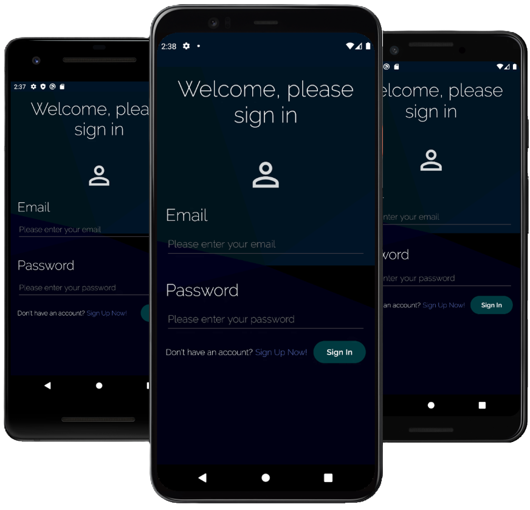

# CARPOOL - Android Application for Ain Shams University Faculty of Engineering

CARPOOL is an Android application tailored for the Ain Shams University Faculty of Engineering community, providing a secure and reliable carpooling service between specific locations on campus.

## Introduction

CARPOOL simplifies commuting for students between Abdu-Basha, Abbasiya Plaza, and Gates 3 and 4 of Ain Shams University. Users are required to sign in with their `@eng.asu.edu.eg` accounts, ensuring a trustworthy community environment.

- **Demo Video:** [Watch here](https://youtu.be/A4YKuGv18Mo)
- **Full Code:** [GitHub Repository](https://github.com/Omar-Mohamed-Ibrahim-Alsayed/Carpool-Application.git) (Private until submission deadline)
<p align="center">

</p>
<p align = "center">
</p>

## Features

### For Riders

- Browse available rides with detailed information.
- Reserve seats pending driver acceptance.
- Manage rides in a cart with payment options.
- View ride history and profile information.
- Offline data persistence and accessibility options.
- UI customization for better accessibility.

### For Drivers

- Web application compatibility.
- Simple ride addition with error handling.
- Manage ride requests and review rider comments.
- Offline data persistence and automatic sign-in.

## UI Design

CARPOOL features a user-friendly interface designed for easy navigation and accessibility across various screen sizes.

## Project Structure

The project is organized into key components:
- **Databases:** Local and hosted databases for data management.
- **Fragments:** User interface components for seamless interaction.
- **ViewModels:** Manage data presentation and interaction logic.
- **Activities:** Main components for user interaction.

## Database Structure

### Hosted Database (Firebase)

- **Rides:** Details of available rides with ride-specific attributes.
- **Orders:** Booking details linked to ride IDs.
- **Users:** User profiles and authentication.

### Local Database (Room)

- **Users:** Local storage for user data and preferences.

## Test Cases

### Sign-Up Test Cases

- Validate input fields for correctness.
- Ensure email format and password strength.

### Sign-In Test Cases

- Handle empty credentials and connectivity issues.

### Client Test Cases

- Validate offline functionality and data synchronization.
- Ensure seamless booking and transaction handling.

### Driver Test Cases

- Validate ride creation and management.
- Handle ride requests and feedback from users.

## Setup Instructions

1. Clone the repository:
```
git clone https://github.com/Omar-Mohamed-Ibrahim-Alsayed/Carpool-Application.git
```

2. Open the project in Android Studio.

3. Build and run the application on an Android emulator or device.


